來到曼哈頓，城市的喧囂讓你眼花撩亂，吵雜的聲音在紐約不曾停止過，那是憤怒汽車駕駛的喇叭、無頭蒼蠅旅客的喧嘩、警車消防車響徹雲霄的鳴笛⋯⋯

> 一個混亂卻有序、吵雜卻安靜、發臭卻清新、實際卻夢幻、寒冷也冷漠，卻美麗的城市。

這是在 2022 年春天離開美國後，我對紐約這座城市下的註解。

從一開始對混亂的大城市感到興趣缺缺，離開時卻是滿載著回憶行囊，紐約的魔力是不管內心多麽抗拒，來到這座城市一訪後，都會在腦海中留下深刻的回憶。

身為一個文化大熔爐，一些混亂是必然，在混亂中如何找到規則，又或是不需要規則，那都是個人的選擇。

對於紐約，在短短時間內我有了很多的觀察，拼湊了我還殘留的記憶後，就讓我透過圖片和文字娓娓道來紐約限定的神奇事物吧。

---

### 關於人類

紐約街上的每個人都活在自己的世界，那是真實的，或是虛幻的，不得而知。

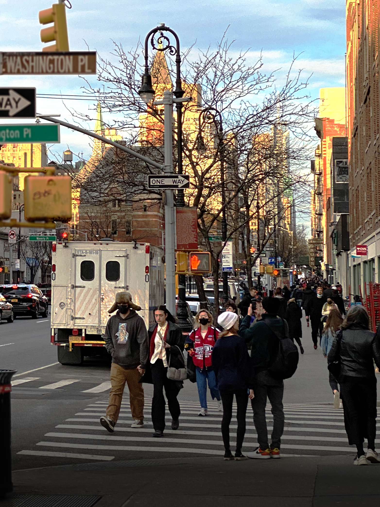

有一群人是「行走的 CD」⋯⋯ 他們唱歌很好聽？喔不，如果我們把時間回朔到九零年代，他們真的就是「行走的 CD」。現在的他們提著用藍芽連線的大音箱，想要讓全宇宙知道饒舌歌曲的美妙之處。

「行走的 CD」出沒地點就和等等會提到的紐約警察一樣，是毫無限制的。有些會一手騎著單車，一手提著音箱從你身邊咻的過去；有不少出沒在地鐵車廂內，數量多到車廂內需要「禁止攜帶手提音箱」這種完全無用處的警告標語；也有一些在角落、在公園、在街邊，相對平凡的地區。

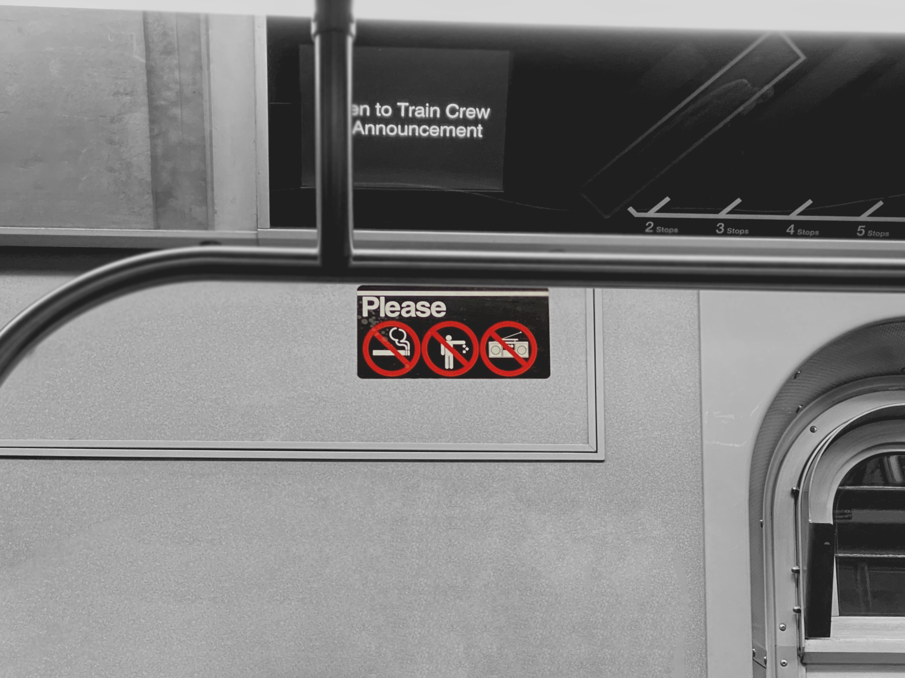

我剛剛有提到紐約警察嗎？就算沒有，在紐約的你也早該看到了。紐約市警局和他們白藍白藍的象徵，在紐約可說是無處不見。

NYPD 的存在絕對是必要的，否則大部分在紐約的紀念品店早就倒閉了。

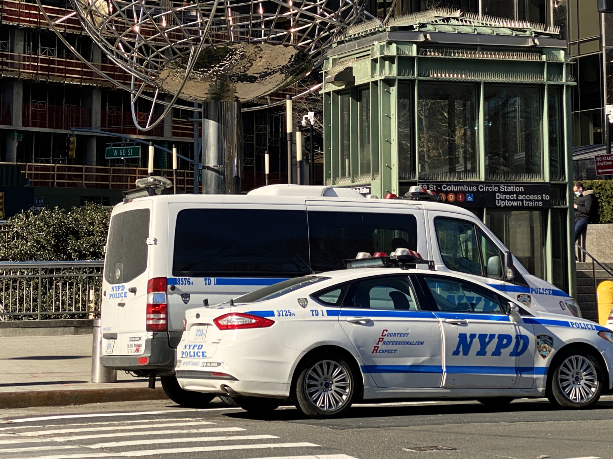

他們在街上和同事們就像好友般的談笑風生，他們也像隔壁幫你作弊的同學，對於一些像是欺騙觀光客這種雞毛蒜皮的小事，必定會睜一隻眼閉一隻眼。

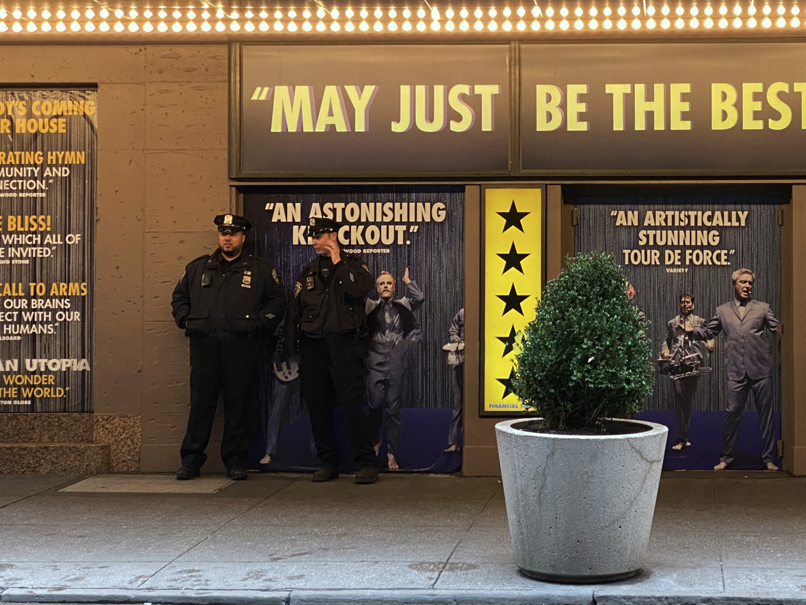

NYPD 已經彷彿是一間大企業了。他們擁有自己的特色和態度，就連警車都有各種尺寸。

在曼哈頓北部的中央公園，你會經常看到一個人牽著六隻、七隻、甚至更多隻狗的畫面，他們是在公園遛狗的「狗狗富翁」。他們受到有錢但沒閒的工作狂雇用，實際上他們並不是這些狗狗的主人。

如果你有在 YouTube 上看國外影片的習慣，你很難不知道 Casey Neistat 這號人物。他的傳奇是在 YouTube 上每天做一部「生活微電影」，一共持續了 534 天，那是只有親自做過影片的人才能理解的成就，這也帶起了後續在 YouTube 上 vlog 影片的熱潮。

紐約是他最愛的城市，只有這裡可以讓他每天有源源不絕的創作靈感，因為過了一個街口就有新的故事。而在百老匯大道上的 368 號工作室則是屬於他的象徵性建築。

---

來到地底下，地鐵的熱鬧程度並不輸地面上的街道。

事實證明，大部分關於地鐵的傳言都是真的。這裡的地鐵昏暗又髒亂，大部分地鐵站都有街友的蹤跡，不時也會出現駭人聽聞的隨機攻擊案件。偏偏它是紐約最方便又便宜的交通工具，每次搭乘地鐵要到哪個景點時，都得抱著興奮又小心翼翼這樣複雜的情緒。

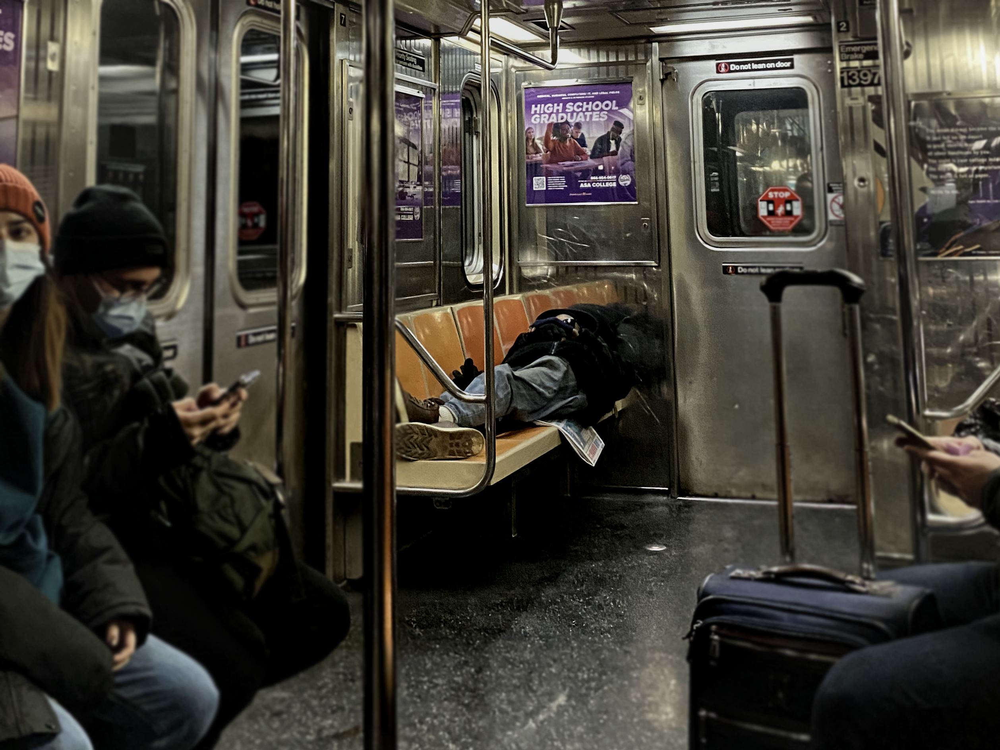

在地鐵車廂內，總是會有表演慾旺盛的人想要秀出拿手絕活，通勤疲乏的乘客買不買單成為熱情的觀眾，就是另外一回事了。

曾經有位「行走的 CD」黑人小哥在車廂內播放刺耳的音樂，準備開始沒有人知道是什麼的表演，在表演前為了炒嗨氣氛，他想要一一的和每個人擊掌，可惜那天不屬於他，沒有乘客要理他，他只好怒氣沖沖的關了音樂開始進行另一個表演：怨天尤人。

在地鐵站你百分之百會遇到的還有一種人類，為了把逃票這個行為美化一點，我稱他們為「地鐵跳跳人」。

他們有些人在趕時間，有些人背著背包，有些人背著樂器，在每個車站的地鐵閘門他們一躍而過，就這樣瀟灑的省了 $2.75 美元。還記得前面提到的隨處可見的 NYPD 嗎？他們當然也在地鐵站，我就說他們會幫你作弊，跳過地鐵閘門逃票這種投機取巧的行為，警察們也只會雙手一攤視而不見。

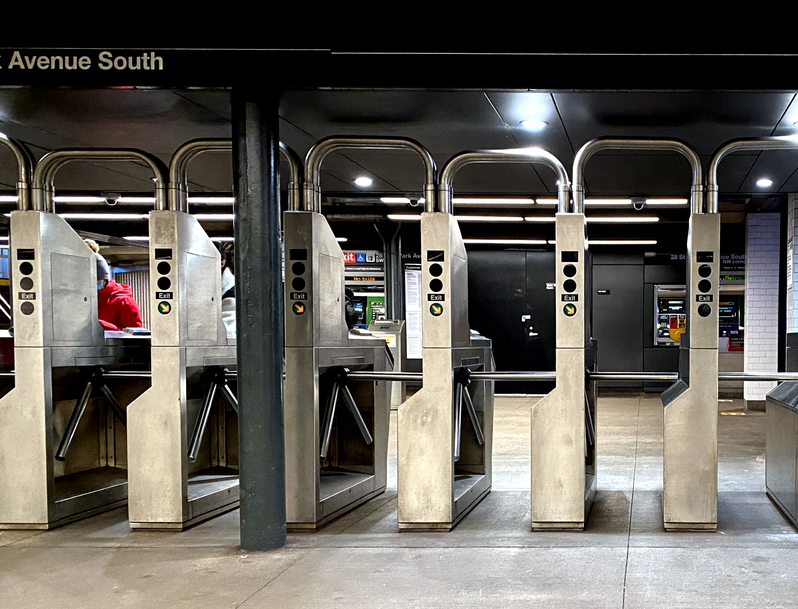

只要走在紐約街頭上，你就知道「文化大熔爐」不是叫假的，就像台北的信義街頭貴婦的出現率高、日本的涉谷街頭充滿走在時尚尖端的年輕人。在 Downtown 的蘇活區充滿貴氣外露的歐美人士、在唐人街和韓國城則是亞洲人的聚集地，走在紐約的不同區域，你能看到每個人類族群的文化和散布蹤跡。

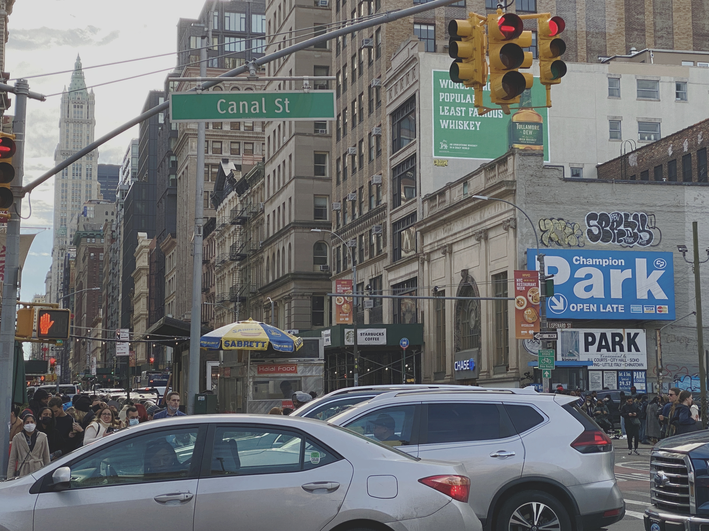

---

### 關於溫度、視覺、氣味

在紐約不只是眼界大開，所有的感官都會受到不同程度的刺激。

在紐約的三次旅行，介於 2022 年的一月中到三月底短短的時間，從極凍的大雪、午後的雷陣雨、到艷陽高照的晴天都讓我遇到了。

下大雪的天氣讓我留下最深刻的印象，不全是因為雪景很美，老實說，路上的雪推都又黑又髒，並不漂亮，更多是因為下雪時伴隨著的強風，穿著羽絨衣，戴著手套毛帽，加厚的羊毛襪，身體仍然抵抗不了而不自主的顫抖。

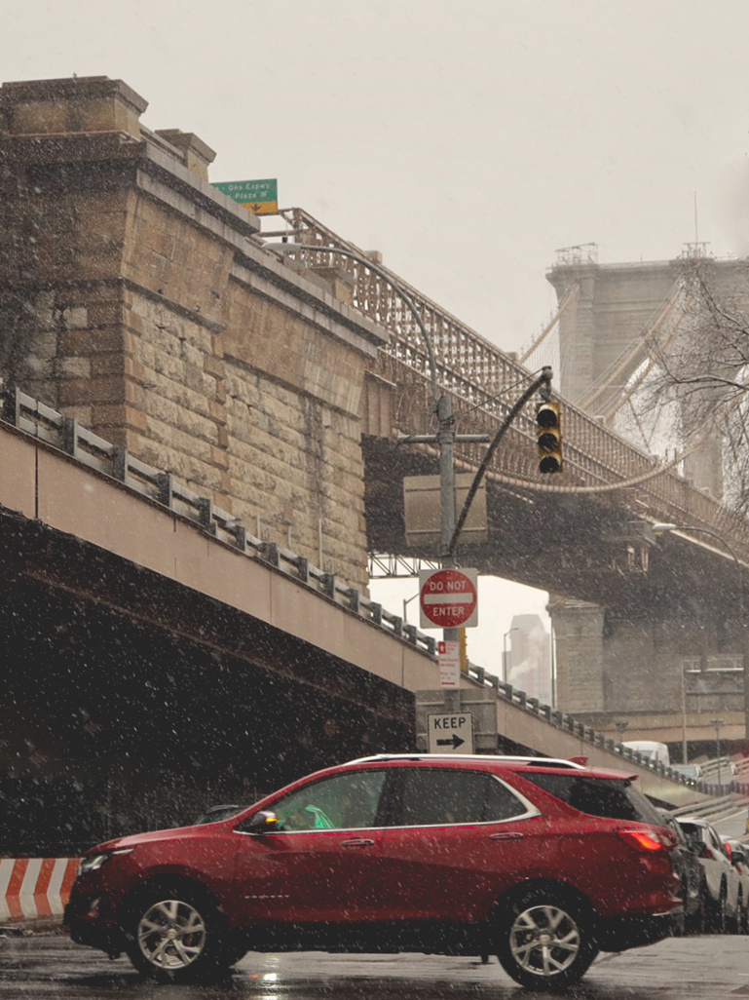

---

每天踏出門都可能有不一樣的景觀，我相信這也是紐約這座城市這麼具有吸引力的原因之一。除了多變的氣候之外，也有不少奇景可能只有在這裡看得到。

道路上隨處可見的小黃、人們最愛的[熱狗攤](https://xdavidchen.com/zh-tw/p/%E7%B4%90%E7%B4%84%E7%86%B1%E7%8B%97%E6%94%A4/)、和時不時在路口出現，橘白相間的[紐約大煙囪](https://xdavidchen.com/zh-tw/p/%E7%B4%90%E7%B4%84%E5%A4%A7%E7%85%99%E5%9B%AA/)是這座城市的標配，

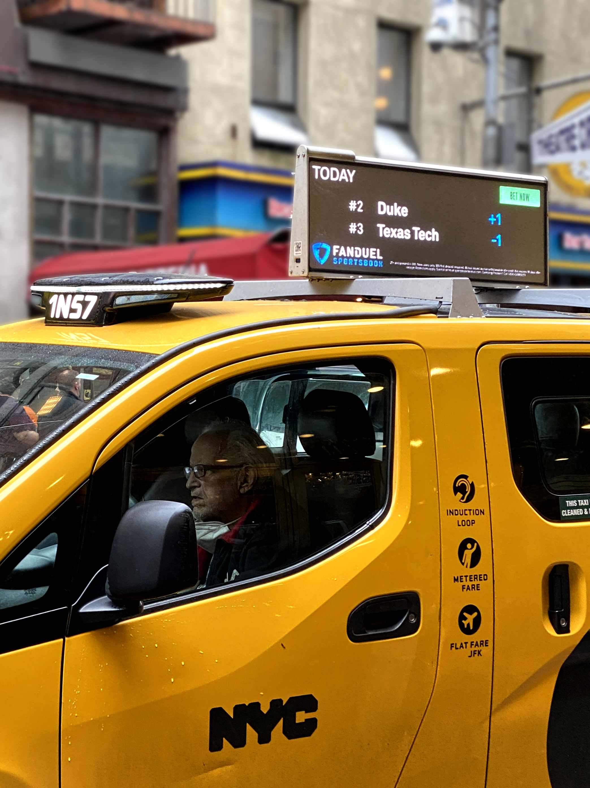

當你行走於高樓之中，有簡陋的騎樓會一路伴相隨。這些看似臨時搭建的騎樓，其實已經是他們身為完成品的樣貌，商家也毫不避諱的直接將店名廣告貼在騎樓上的面板做標示。

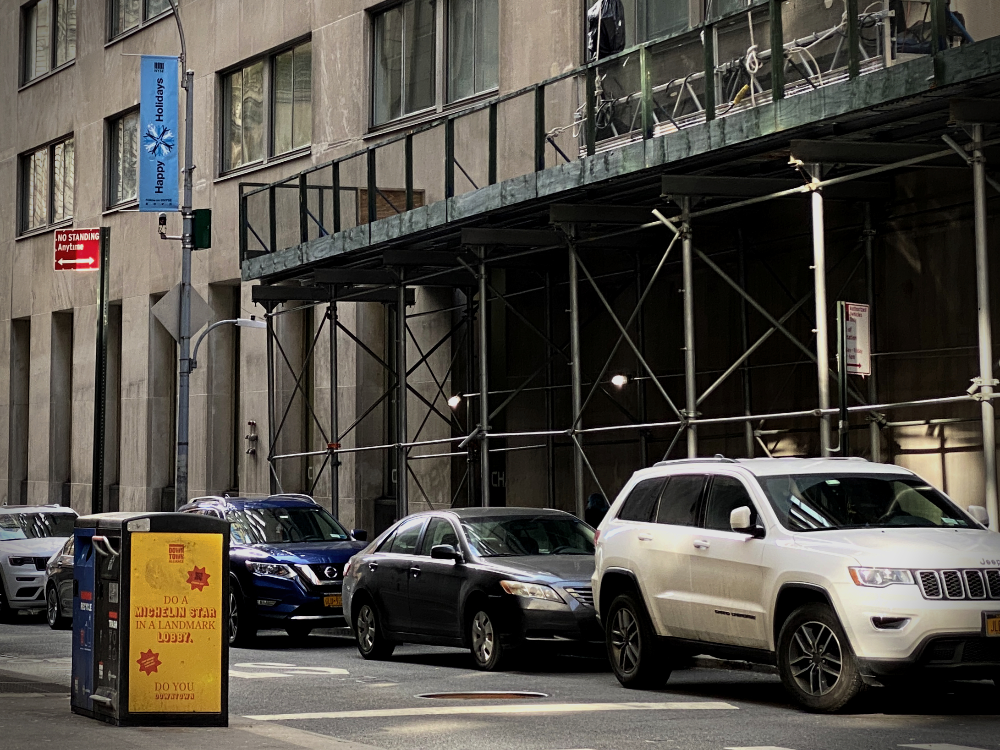

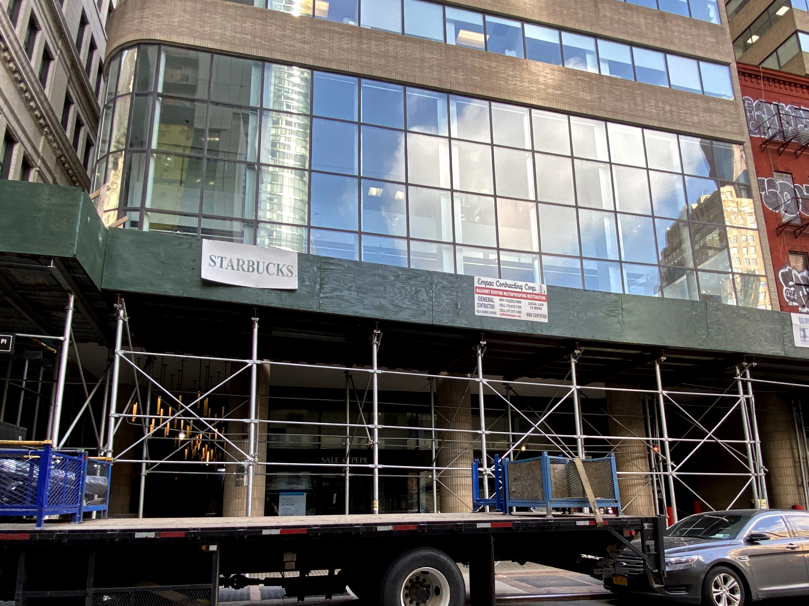

在曼哈頓的中心，隔一個路口就是百老匯大道，世界聞名的百老匯秀每天都在各個劇院上演好幾場。

距離百老匯幾個街區的地方，這是冬末春初時的布萊恩特公園，夜晚的溜冰場上還擠滿著溜冰的人們。

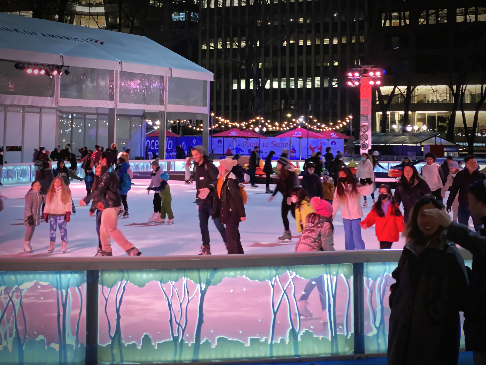

向著北方一直走，不久後中央公園會出現在你的面前。這個季節的中央公園是乾黃的。藍天再怎麼藍，時間沒到春天，鮮豔的綠色就是不會來。這個在高樓大廈中顯得突兀的大公園，是街頭藝人謀生的地方，是當地居民暫時逃脫壓力的地方，是旅客暫緩腳步休息的地方。不只人類，甚至連動物們都在這裡找到一席之地。

---

會陪著你一起逛紐約的除了小黃、煙囪、和騎樓，還有一些奇怪的氣味。

首先，大麻味是不會缺席的，夠熟門熟路的人，在街口就能輕易購入大麻，不要問我怎麼知道的。

再來是關於尿騷味這件事，其實在紐約我從來沒有很明確地聞到，更常聞到的味道更像是各種垃圾交疊出的氣味，就好比走在台灣的街道上，偶爾撲鼻而來的臭水溝味。不過看到街上一堆堆垃圾疊成山的畫面，我也不是很意外一直聞到奇怪的氣味。

奇怪的味道撇一旁，我想我最愛的氣味還是 [Shake Shack 漢堡](https://xdavidchen.com/zh-tw/p/shake-shack-nyc/)的香味。

---

### 關於夢想、金錢、自己

一塊小小的土地，承載著八百萬人的夢想，這是一座建造在夢想上的城市。在這裡生活的人們不是正在追逐著現在這個夢，就是死命的掛念著從前的那個夢。

完全可以理解為什麼這裡是人們能夠快速致富的地方，一切的一切都充滿著資本主義的影子，就連世界上最有名的城市天際線，都有設計好的日落來為紐約加上不少分；西裝筆挺的證券交易員快速地穿梭在華爾街，「一分鐘幾百萬上下」所描述的應該就是他們的日常；平均月租十萬台幣的小套房，又或是五萬台幣的客廳隔間，你想要住的是哪一間？

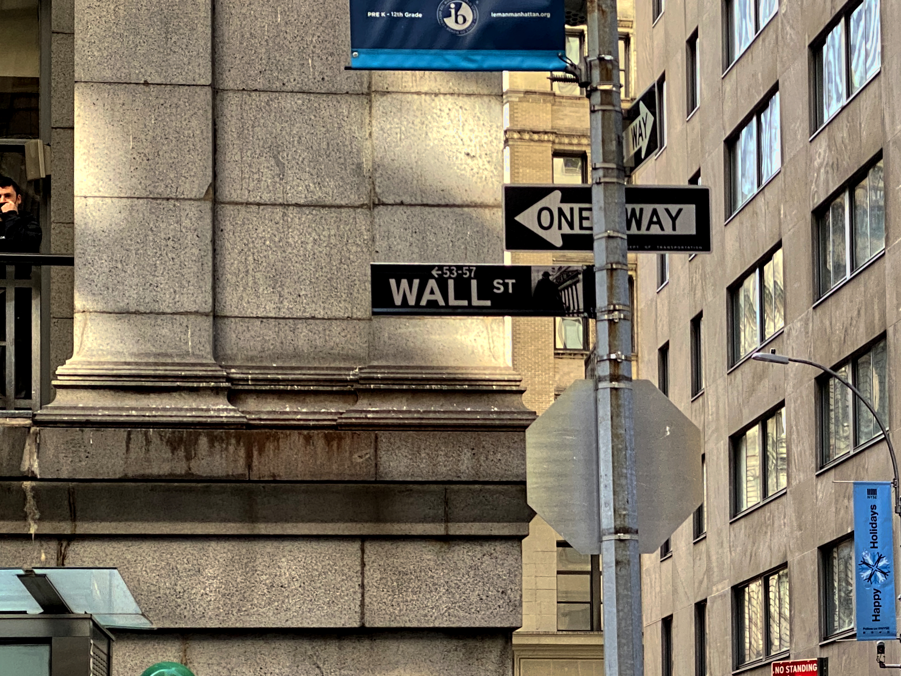

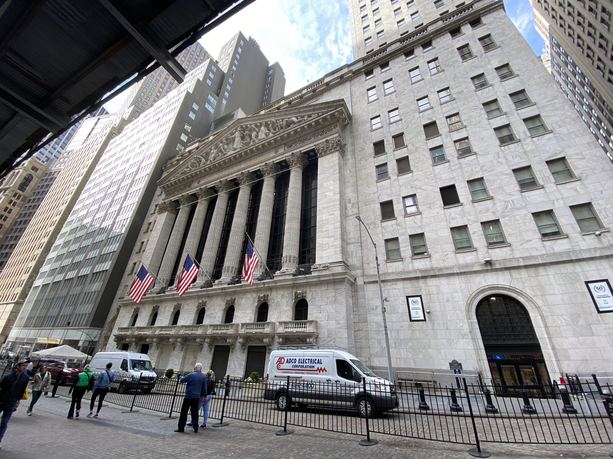

時代廣場一天台幣二十萬元起跳的廣告費用，簡單明瞭的說明了企業家們能在這座城市找到成功的原因。

---

**沒人在乎你。**

沒有人在乎你是哪位，你來自哪裡，你在忙什麼，人們沒有時間多管人們的閒事，每個人在乎的是自己。

自私就有什麼不好嗎？一路自私的走著自己想走的路堅持下去、自私的用自己的方法達成目標，一路上肯定也會「不小心」幫助到不少人、對這座城市、這個社會、整個世界做出一些貢獻吧？

對我來說，沒有帶著任何目的來拜訪紐約是一種福氣。在每一個混亂場景，我靜靜的從一旁的角落觀察，猜測這個愁眉苦臉、穿著潮牌寬鬆大學踢的青少年的愛情故事；那個笑容開心到詭異的街友，是他抽大麻的第幾年；旁邊拎著也許是唐人街買到的冒牌 Gucci 包、講著一口流利的西班牙文、穿著緊身金色亮片連身裙在時代廣場前面瘋狂連拍的女子，她的包包到底是不是贗品？

這隻馬爾濟斯 ⋯ 恩，主人果然瘋瘋癲癲的，那隻有漂亮毛色黃金獵犬 ⋯ 主人果然穿著高雅的大衣，這裡的人如其狗，狗如其人，你說這是自我個體展現的極致也不為過吧。

我可能是唯一一個在紐約還對他人感到有興趣的人，又或許像我一樣的人就存在在我身邊，只是我們都有默契的選擇表現的像別人一樣。

---

### 一顆大蘋果

有些事情只能在紐約的地鐵目擊，有些街景只能在紐約的路上看到，有種回憶只能在紐約留下。我還沒有環遊世界，但紐約肯定是世界上最神奇的城市之一。

在《六人行》（Friends）的 Central Perk，《創造安娜》（Inventing Anna）的 281 Park Avenue，《明天過後》（The Day After Tomorrow）冰凍的自由女神像，《華爾街之狼》（The Wolf of Wall Street）的華爾街，*Empire States of Mind* 聽過的紐約，*New York, New York* 聽過的紐約 ⋯⋯ 紐約無人不曉。

這是不管你多討厭大城市，一生都必須要造訪一次的地方 — 紐約。

`Winter 2021, David Chen 📍New York City, U.S.A`

> 即將啟程前往紐約？[購買紐約通行證](https://affiliate.klook.com/redirect?aid=30002&aff_adid=636616&k_site=https%3A%2F%2Fwww.klook.com%2Fzh-TW%2Factivity%2F11167-new-york-city-pass-attractions-new-york%2F)用六折的價格取得五大景點門票。

**此票卷連結為合作行銷連結，點擊它購買就等於不花一毛錢請我喝一杯珍奶！*