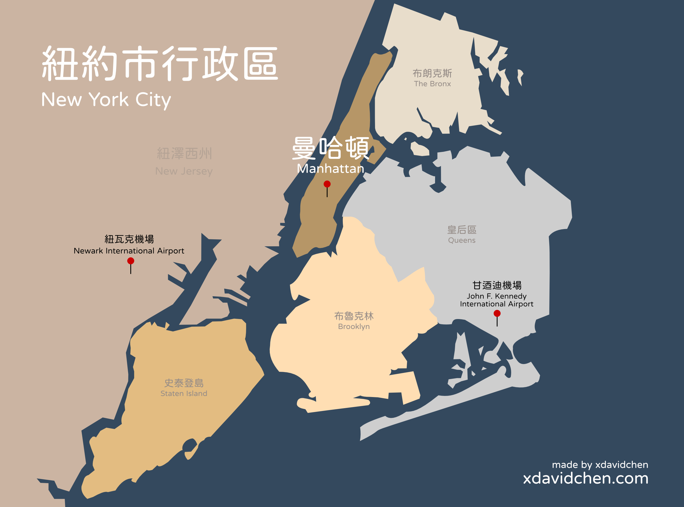

> 現在花三十分鐘了解紐約，省下旅程中的三個小時。

## 使用說明書

這篇文章分成了六大章節，喜歡隨興旅遊（Spontaneous travel）的人，你只需要看**行前須知**來確保了你在出發前對紐約有最基本的了解，並且讓你的旅程平安順遂，和最後的**優惠票卷**幫自己省一點錢。

喜歡把一切的規劃好的人，可以把文章加入書籤列，隨時回來查看需要的資訊。

<!-- 如果你是從台灣出發，請一同參考「出發美國」，了解機票、申請簽證、過海關、電壓、手機網卡、等等必要須知事項！-->

## 紐約旅遊 — 行前須知

> 給不喜歡把一切規劃好，喜歡隨性旅遊的人。

### 關於紐約的迷思

**紐約和曼哈頓是同一個地方？**

美國五十個州，每個州都有縣（郡）市，縣郡市裡再分行政區。

紐約位在美國東北岸，**大部分人在講紐約時，通常指的是紐約市**，紐約市位在紐約州的最南部。

紐約市有五個行政區[^1]，從北到南分別是：布朗克斯、曼哈頓、皇后區、布魯克林、和史泰登島。

更具體來說，**觀光客最常聽到的紐約，幾乎都是在講曼哈頓**這個行政區，這裡也是最多電影取景、觀光景點最多的旅遊勝地。

**曼哈頓是一個區？聽起來一天就可以逛完了**

在實際走訪之前，我唯一能聯想到跟紐約有關的地名就是「曼哈頓」了。要再更細就只能想到自由女神像、帝國大廈、時代廣場景點類的名稱。「曼哈頓應該很小，因為沒辦法再被分割了」的想法就這樣一直在我腦中存在著。

以土地面積來說，曼哈頓行政區（59平方公里）等於四分之一個台北市。

曼哈頓行政區裡面當然還有更多更細小、更明確的分區。逛曼哈頓只花一天的時間？想好好的逛，一個禮拜都嫌不夠。

### 暢遊曼哈頓

如果從地圖看曼哈頓，你會發現它是一塊長條型的島。在這個小島上有數不清的高樓大廈、交錯的街道、形形色色的人、奇奇怪怪的事情在發生。因此，要在曼哈頓玩的開心、安全、又不迷失方向，並不是一件簡單的事情。

不過別擔心，我幫你把複雜的事情簡單化了。大方向來說，你只要把三件事情搞對就不會遇到什麼太大的問題：**方向、區域、和態度。**

#### 把方向搞對

當你遇到非常寬大卻還是塞車塞到不行的道路上，你就知道你位在南北向的大道（Avenue，縮寫 Ave.）上，他們的命名方式是從東邊到西邊、用數字 1 ~ 11 來命名。

相對比較窄小、沒什麼車子的道路是東西向的街道（Street，縮寫 St.），這些街道從南起到北為 1 街一直到 240 多街。

以上兩件事情代表著你用數字就能辨識所在方位。

要注意的是「以數字來命名」的街道是辨識方向最簡單的方法，但這些街道之間，還是有不少不是用數字命名的路。舉例來說，百老匯大道就是一條非數字命名的道路。

另外，第 1 街往南還有一大塊區域不是用序數來命名，像是華爾街就在這個範圍內；以旅遊來說**往北最遠你只需要到 86 街附近，再過去的區域治安堪憂**。

在曼哈頓生活的當地人也常用街區來描述公司、住家或自身的所在位置。

#### 把區域搞對

除了可以用第幾街來確認自己的方位，知道自己大概在曼哈頓的哪一個區域也會讓你對規劃行程非常有幫助。以下簡介曼哈頓的上城、中城、下城如何區分，更後面再來詳細列出各區的觀光景點。

**上城（Uptown）**：59 街以北，也就是中央公園南起以北的區域。

**中城（Midtown）**：30 街到 59 街之間的區域，時代廣場、中央車站、和地鐵轉乘的中心車站都在 Midtown。

**下城（Downtown）**：Downtown 是 30 街以南。

#### 把態度搞對

很好！現在你就算手機沒電也不用害怕在曼哈頓迷路了。接著要讓你的旅程一路順遂，減少意外發生的機會。

最簡單的守則，就是用「假在地人（Act Like A Local）」的心態在紐約旅遊。

將以下三點銘記在心，旅遊時養成習慣：

**1. 擺出厭世臉**

紐約治安有多糟？進入每個室內觀光景點都要做一次安檢，這樣夠糟嗎？

紐約有一大堆瘋子。我沒有在誇飾，這是最委婉的講法了。

你要做的就是在移動時目空一切，除了自己開心拍拍照以外的時間，對著陌生人請隨時擺出你的厭世臉，也不要頻繁的跟陌生人對眼。

很多瘋子只要一對上眼就會馬上對你大聲咆哮，更瘋的可能朝你飛奔要攻擊你，這完全不是在開玩笑！

**2. 走路走到飛**

你知道當地人和觀光客最大的差別在哪嗎？當地人走路的速度快到飛天。當然，該停下來欣賞的、照相的還是要停下來，其他行走的時間，就聽我的話吧：當個走路飛快的觀光客。

當你看到突然有一大群人往某個地方聚集時，請少湊熱鬧，一群人聚在一起是恐怖份子最喜歡攻擊的目標。身為一個觀光客，你要做的就是查好景點之間的路線，然後在點到點之間快速移動。

**3. 隨時保持警戒**

我知道這句話在出遊時聽起來多麽掃興，很遺憾的是你**必須**要這麼做。

探頭探腦的觀光客，尤其是稚氣的亞洲人，對有心人士來說擺明就是肥羊；沒有人會去上廁所時把手機、電腦擺在桌上；沒有人會隨時對你笑臉迎人；沒有人會對你的財物遺失負責 — **保管好自己的財物、確保自己的安全，都是你自己的責任**。

### 紐約氣候

我自己只有在冬末、初春的時候去過紐約，從網路上的歷史資料來看，如果你是夏天和秋天前往紐約，穿的跟在台灣同時期應該不會差太多；但如果你是跟我一樣，在冬天和春天去紐約旅遊，在打包行李的時候，腦中請想像電影《明天過後》（The Day After Tomorrow）紐約冰天凍地的情景，紐約下雪的時候身體感受到的差不多就是那麼冷。

**寒季（冬天 / 春天）**

12月初至 3月中，平均溫度 9°C 以下。 紐約最冷的月份是一月，平均低溫為 -2°C，平均高溫為 4°C。

**暖季（夏天 / 秋天）**

6月初至 9月中，平均溫度 24°C 以上。 紐約最熱的月份是七月，平均高溫為 29°C，平均低溫為 21°C。

---

## 紐約趴趴走 — 市區交通

在交通方面，與其我把所有可能性全部都細細地列下來，不如就列出自己旅遊時曾經選擇過的交通方式還有該注意的事情，讓你不需要花太多無謂的時間和精力在一大堆資訊中找答案。

交通分成兩部分：機場和市區之間的交通，和曼哈頓市區內的交通。

### 機場和市區往返

![image airport]

如果你是搭飛機來到紐約，通常你會降落在三個機場之一：甘迺迪國際機場、紐瓦克國際機場、拉瓜迪亞機場。

**甘迺迪國際機場（John F. Kennedy International Airport, JFK）**

大部分的人來到紐約都會降落在甘迺迪機場，從這裡來回曼哈頓市中心有三種方式：

1. 機場捷運 AirTrain + 地鐵
2. 計程車
3. Uber 或 Lyft

**1. 機場捷運 AirTrain ＋ 地鐵**

如果你是第一次來到紐約旅遊，我**非常不推薦**你帶著大包小包搭乘機場捷運加上地鐵。

要搭機場捷運加上地鐵往返甘迺迪機場和曼哈頓的話，可以參考下面的兩個路線：
- **目的地在 Midtown 曼哈頓**：搭乘 AirTrain 到牙買加站轉乘地鐵 E 線（Jamaica Station ＋ Transit E Metro）
- **目的地在 Downtown 曼哈頓**：搭乘 AirTrain 到霍華德海灘站轉乘地鐵 A 線（Howard Beach Station ＋ Transit A Metro）

我不推薦這個方法給初訪紐約的旅客原因有很多，關於它唯的一優點就只有價格便宜。一趟 AirTrain $8 美元加上地鐵單趟 $2.75 美元，總共是 $10.75 美元。

- **價格**：$10.75 美金
- **時間**：約一小時
- **優點**：價格低
- **缺點**：只能使用地鐵卡付費（Metro Card）、需搬運行李、非點到點移動、較不安全、有可能誤點

**2. 計程車**

從機場到曼哈頓，計程車的車資是固定的費率，一趟單程基本費 $52 美元，在尖峰時段每日下午四點到晚上八點，加 $4.5 元，如果司機走了需要付道路通行費的路段也會加在費用裡面（大約 $5 美元，到曼哈頓通常不會經過這些路段），最後再加上 15% 的小費約 $8 美元。

所以算下來總共是：$52 ＋（尖峰時段 $4.5）＋（通行費）+ 小費（15% = $8），共約 $60 ~ $70 美元。

- **價格**：$60 ~ $70 美金
- **時間**：非尖峰時段約 40 分鐘，尖峰時段可能超過一小時
- **優點**：免搬行李、價格落差小、點到點移動、多人可平分費用、全天營運
- **缺點**：價格較高、有可能塞車

*請小心避免機場航廈內非法拉客的司機，直接前往航廈外的計程車招呼站搭乘。

**3. Uber 或 Lyft**

根據時段、當下有叫車需求的人數、以及實際前往的確切地點，系統顯示的車資大約會落在 $50 ~ $100 美金。

- **價格**：$50 ~ $100 美金
- **時間**：非尖峰時段約 40 分鐘，尖峰時段可能超過一小時
- **優點**：免搬行李、點到點移動、價格計算方式單一、價格有可能比計程車低、多人可平分費用、全天營運。
- **缺點**：價格浮動大、有可能塞車

**甘迺迪機場往返紐約市區比較表**

| 同行人數           | 推薦交通方式          | 單程價格（合計，美金） |
| :----------------- | --------------------- | ---------------------- |
| 單人小（少）件行李 | 機場捷運 ＋ 地鐵      | $10.75                 |
| 單人大（多）件行李 | 計程車 / Uber 或 Lyft | $60 ~ $70 / $50 ~ $100 |
| 兩人以上同行       | 計程車 / Uber 或 Lyft | $60 ~ $70 / $50 ~ $100 |

更多詳細資料，請參考甘迺迪機場[官方網站](https://www.jfkairport.com/to-from-airport/public-transportation)。

**紐瓦克國際機場（Newark Liberty International Airport, EWR）**

紐瓦克機場的班機主要服務美國國內和歐洲國際線。由於這個機場位在離曼哈頓較遠的紐澤西州，因此沒有地鐵進紐約市區。

從這裡到曼哈頓的交通方式有巴士、計程車、 Uber 或 Lyft、還有機場捷運 AirTrain。

我第一次飛到東岸就是降落在這個機場，個人非常不推薦搭乘巴士，不但班次少，環境差，搭車地點標示不明，票價還很貴。

計程車、Uber 或 Lyft 直接在機場接送區叫車，除了價格偏高，應該不會有太大的問題。如果下一次我降落在這個機場，我應該會選擇搭搭看機場捷運 AirTrain。

更多關於紐瓦克機場的交通資訊，可以參考紐瓦克國際機場[官方網站](https://www.newarkairport.com/to-from-airport/public-transportation)。

**拉瓜迪亞機場 (LaGuardia Airport, LGA)**

從機場的[官方網站](https://laguardiaairport.com/)來看，拉瓜迪亞機場的航線目前都是美國國內線，大部分的人應該不會降落在這個機場。

拉瓜迪亞機場有三個航廈，每個航廈都有公車、地鐵、計程車、以及 Uber 或 Lyft 可以搭乘前往曼哈頓。根據你選擇的交通方式，票價從免費到 $50 美元左右都有可能。

如果你是降落在這個機場的人，我會假設你的英文程度應該不錯，比較有機率在美國飛國內線，詳細的交通資訊可以直接到機場的[這個頁面](https://laguardiaairport.com/to-from-airport/public-transportation)做參考。

如果你很懶想要我整理給你，歡迎[來信](mailto:david@xdavidchen.com)承認你很懶，我會幫你整理資訊。

> *由於我三次前往紐約旅遊都不是從機場出發，所以這是唯一一個部分我自己沒有所有交通方式都親身體驗過，而是整合國內外網站能夠查到的、**非自行租車**的大眾交通做整合。

---

### 市區交通 — 雙腿

在紐約旅遊，雙腿是荷包的好朋友。

紐約的街道上無時無刻都有奇怪的事情在發生，走在路上才能用視覺、聽覺、和嗅覺來完整的體驗這個城市。只要當天行程安排的好，景點之間的距離並不會太遠，通常路過幾個街區就能抵達。

你逛過街嗎？在紐約會讓你有真的在「逛街」的感覺。

---

### 市區交通 — 地鐵

只要是比較長距離的移動，紐約地鐵通常都是我的第一選擇。

路線範圍涵蓋超過整個曼哈頓區，不管距離長短、轉乘多少次，進了站搭一趟就是 $2.75 美元（約台幣 90 元），在紐約算是便宜又方便的交通方式。

話雖如此，地鐵應該是紐約最惡名昭彰的特色之一了吧？事實證明，所有關於紐約地鐵的傳聞都是真的。

地鐵站昏暗髒亂、參雜點尿騷味、處處可見流浪漢和精神病患、[被人推下鐵軌](https://www.insider.com/family-of-michelle-alyssa-go-speaks-out-after-deadly-attack-2022-1)、[在地鐵站被隨機攻擊](https://abc7ny.com/hammer-attack-subway-brutal-robbery-woman-new-york/11598857/)、想不開的人跳軌，你能想到和無法想像的事情，都有可能在這裡發生。

雖然風險存在，但紐約地鐵卻是每個來到紐約旅遊的人幾乎不可能不使用的交通工具，所以在靠近地鐵站和搭乘地鐵時，請記住**離遊民和精神病患遠一點**、**少滑手機，隨時注意四周環境**、**行走時腳步迅速移動**。

**購票方式**

- **地鐵卡 MetroCard**：\
一張薄到不行的紙。可以在售票機購買，首次購卡要多花 $1美元，儲值可以用美金現金和**美國當地的銀行卡**支付。售票機有時候會吃錢、台灣的信用卡刷不過，所以我**不推薦**你使用地鐵卡搭乘紐約的地鐵。
- **行動支付 / 刷卡**：\
只要有支援無線付款功能，可以直接用手機或信用卡感應進站，我推薦這個方法。

**撈叨人的提醒**

- **搭對方向**：\
在地鐵站的出入口你會看到這個站有哪幾條路線、以及往哪個方向。有些比較小的站往 Uptown 和 Downtown 的出入口是沒有連通的，進了站發現弄錯方向就只能出來，到對向再付一次錢往正確的方向。
- **任命搬吧**：\
紐約地鐵大部分的站都只有樓梯，在 2022 年初前往旅遊的時候有發現有些站開始有電梯、或是正在加裝電梯了，不過不要期望太高，大部分時間還是靠你的雙腿吧！
- **當好小孩**：\
在進站刷卡的時候，你可能會看到很多地鐵跳跳人。沒錯，他們正在逃票，就算在警察面前他們也照樣這樣做。身為旅客請認命花錢，我希望你能平安快樂回家。

---

### 其他交通方式

下列是我還沒嘗試過也還沒時間整理資訊的交通方式：

- Citibike 腳踏車
- 公車
- Lyft / Uber / 計程車

以上就是所有前往旅遊前你需要知道的事情，喜歡隨性旅遊的人可以出發了！

- **加入書籤**：\
有打算要逛景點但不想現在做功課的人，可以把這篇文章加到網頁書籤，供旅程途中參考。
- **紐約景點優惠套票**：\
根據我自己的經驗，我很推薦你購買紐約市景點套票 New York City Pass，和分別購買景點的門票相比，價格打了六折左右。

---

## 紐約必訪景點

來到最令人興奮的部分了！這裡包含了所有我曾經去過或是路過的觀光景點，每個景點有簡單的介紹、地理位置、和開放時間，讓你在大略安排行程的時候可以不用一直切換不同的網站和語言尋找資訊，不過如果想要知道更細節的內容，像是節日開放時間或是特定活動，還是要參考官方網站來取得最新資訊喔！

### 上城 Uptown

#### 大都會博物館 The Metropolitan Museum of Art — 82nd St.

簡介：紐約時尚週

- 地址：1000 5th Ave, New York
- 開放時間：10:00 ~ 21:00，週三休
- 門票：30 USD（詳細請見[官網](https://www.metmuseum.org/visit/plan-your-visit#tickets)），包含在 NYC Pass？

#### 美國自然史博物館 American Museum of Natural History — 79th St.

簡介：博物館驚魂夜，常常要排隊，官網預約時間

- 地址：200 Central Park West, New York
- 開放時間：10:00 ~ 17::30
- 門票：28 USD（詳細請見[官網](https://tickets.amnh.org/select)），包含在 NYC Pass？

#### 中央公園 Central Park — 59th St.

簡介：溜冰、野餐、散步、城市天際線、街頭藝人、動物園

- 地點：59 街以北至 110 街
- 開放時間：早上至半夜（依季節會有所調整）
- 門票：公園免門票

#### 中央公園內動物園 Central Park Zoo - 

簡介：

- 地點：
- 開放時間：
- 門票

#### 路過看看

**茱麗亞音樂學院 The Juilliard School / 林肯中心 Lincoln Center for the Performing Arts — 65th St.**

簡介：知名音樂學院

地址：60 Lincoln Center Plaza, New York

### 中城 Midtown

#### 紐約現代藝術美術館 The Museum of Modern Art (MoMA) — 53rd St.

![image of MoMA]

簡介：梵谷、安迪沃荷、紀念品店

地址：11 W 53rd St, New York

開放時間：SUN - FRI 10:30AM - 5::30PM；SAT 10:30AM - 7PM

門票：25 USD（詳細請見[官網](https://www.moma.org/visit/)），包含在 NYC Pass？

#### 時代廣場 Times Square — 45th St.

簡介：購物中心，m&m 旗艦店？？、廣告看板（要價多少呢？）、必拍照、小心騙子、注意安全

#### 紐約公共圖書館 New York Public Library — 42nd St.

![library image]

簡介：

地址：476 5th Ave, New York

開放時間：MON - SAT 10AM - 6PM；SUN 1PM - 5PM

#### 紐約中央車站 Grand Central Terminal — 42nd St.

![image]

簡介：

地址：89 E 42nd St, New York

開放時間：5:15AM - 2AM

#### 百老匯大道 — 貫穿曼哈頓

簡介：歌劇魅影（2023 停演）

#### 帝國大廈 Empire State Building — 34th St.

![empire state building image]

簡介：城市天際線、電影取景地、夕陽

地址：20 W 34th St., New York

開放時間：MON - THU 10AM - 10PM；FRI - SUN 9AM - 10 PM

#### 麥迪遜花園球場 Madison Square Garden — 31st St.

![madison square image]

簡介：world's most famous arena、林書豪、紐約尼克

地址：4 Pennsylvania Plaza, New York

#### Vessel

#### Rockefeller Center 

#### Summit One Vanderbilt

#### Macy's

#### 路過看看

Casey 368

### 下城 Downtown

#### 熨斗大廈 Flatiron Building — 23rd St.

![flatiron building image]

簡介：電影取景地、特色建築

地址：175 5th Ave, New York

#### 漂浮公園 Little Island — 14th St.

![little island image]

簡介：散步、城市天際線、街頭藝人、夕陽、海景

地址：Pier 55 at Hudson River Park Hudson River Greenway

開放時間：6AM - 11PM

#### 華盛頓公園 Washington Square Park — 6th St.

#### 紐約大學 New York University — 4th St.

#### 唐人街 Chinatown — Canal St.

簡介：冒牌包包

#### Wall Street

簡介：金牛

#### 自由女神像

1. Battery Park
2. 自由女神島
3. 移民博物館

#### 911

1. 911 紀念館
2. One 世貿中心
   1. 購物

#### Trinity Church

#### 布魯克林大橋

#### The Dumbo

#### Soho

#### 路過看看

Park Ave 168 創造安娜

## 路走多總是會餓 — 紐約餐廳＆食物推薦

### 早午餐

In Common Café NYC

Australian Brunch

### 正餐

Shake Shack (食紀)

牛排館

### 點心

路邊熱狗攤

起司蛋糕店

Banana Pudding

### 飲料店

很多ㄟ，等我慢慢更新。

### 不去也沒關係

Red Lobster

K Town BBQ：[不想付小費？快跑！](https://xdavidchen.com/zh-tw/p/%E4%B8%8D%E6%83%B3%E4%BB%98%E5%B0%8F%E8%B2%BB%E5%B0%B1%E5%BF%AB%E8%B7%91/)

## 貴死人的好歸宿 — 紐約飯店＆旅館推薦

### Pod Times Square

<!-- 台灣人開的飯店？ -->

## 當荷包在哭泣 — 紐約優惠＆票卷

### New York City Pass

[^1]: 布朗克斯（The Bronx）、曼哈頓（Manhattan）、皇后區（Queens）、布魯克林（Brooklyn）、史泰登島（Staten Island）