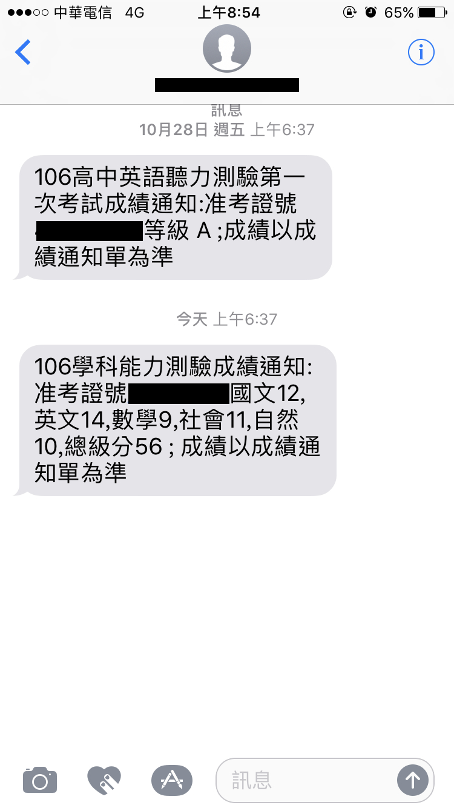
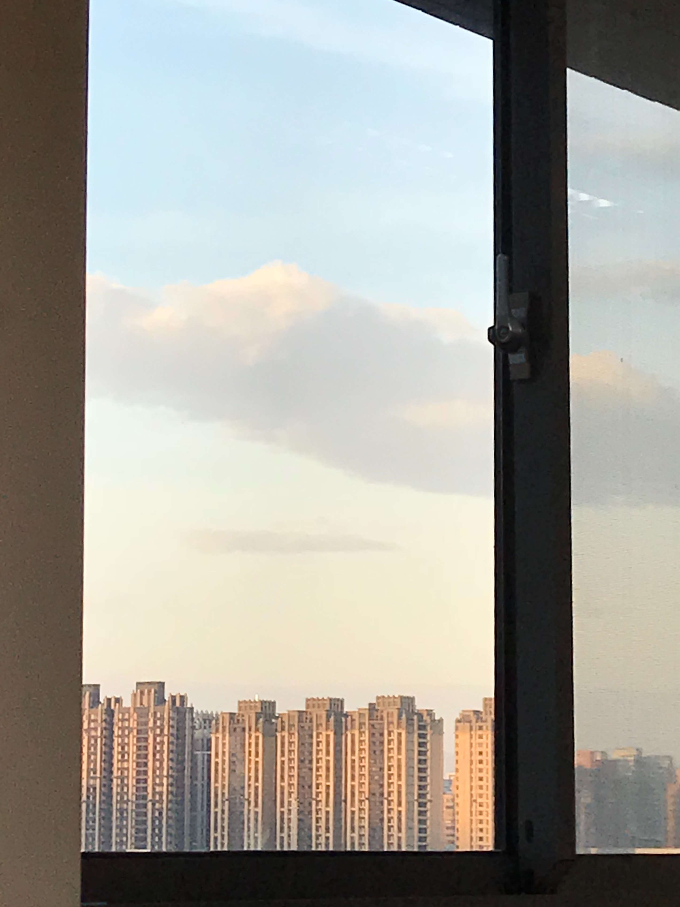

>  透過護目鏡看著窗外阿聯酋的大型客機，再過幾分鐘就要登機前往德國留學了，在疫情間，這一切的一切都顯得非常不真實⋯⋯。

---

自從小六暑假去了一趟美國參觀了范德堡大學[^1] 的校園，就對國外留學有莫名的憧憬。那時我對留學只知道一件事：很貴。

不想造成家裡太大的負擔，自然而然的往稍微學費低一點的國家找來圓這個夢。讀高中時，輾轉得知在歐洲有一些國家讀大學是不用學費的，最後在德國和法國之間草率的決定要去德國讀書，揪了好朋友開始上德文家教。

當時還是高中生，上網查資料的能力僅限於查單字的翻譯，對於留學的其他事情完全沒有任何頭緒。在學校，我只有一個目標：學測考過 53 級分。別問我，我壓根不知道考過了 53 級分代表什麼意思，達標了就有機會去德國讀大學是我唯一知道的資訊。

放榜的一早，手機收到了大考中心寄來的簡訊：56 級分！

不過就算成績達標了，早就因為「準備學測」這個藉口暫停了好幾個月的德文課、不知道要做哪些準備才能留學，那一兩年剛好又是恐怖份子在歐洲最猖狂的時期，留學計畫就這樣取消了⋯⋯

---

我像個向現實妥協的年輕人，苟且的選擇了身為學生以來最擅長的英文繼續讀下去。進了輔大之後，我還是感到有些不甘心，於是開始研究有沒有機會可以出國讀書。

交換學生從來不是我考慮的選項，因為在所有聽過看過的交換學生經驗裡，全部都好像是出國去玩的。我偏好的留學是生活在異國，給自己更多生存上的挑戰，那樣對我來說才能真正獨立、成長、體驗生活。

某天在網路上偶然發現了「雙聯學位」這個名詞，四年內可以拿到兩個學位？根本賺翻。後來才知道近幾年不少大學開始推出類似的計畫，讓學生有更多元的選擇。恰好輔大英文系和德國的拜羅伊特大學[^2]英文系有簽約，從大一下學期我就決定要以「四年內完成雙聯學位」和「第四年在德國留學」為目標過著大學生活，而在大二時意外又多修讀了一個領導學程，就是另外一個故事了⋯⋯。

以修的課程數量來講，我和雙主修的人應該差不多，差別在於我修的所有課程都集中在英文這個專業。

這是很艱辛的過程，為了在三年內修完四年的課程，幾乎每個學期都是三十學分的在讀。日間部能塞的就這麼多堂課，有時需要晚上到英文系的夜間部上課，又因為英文系每學期開的課不夠多，我必須往上修英文系研究所、甚至是跨文化研究所的課程，同時為了德國生活需要，也和德文系大一的同學一起修了幾堂德文系必修。

---

正當一切照著計畫順利進行時，COVID 來了！隨著各國一個接著一個關閉邊境，留學計畫增加了許多不確定性，我該放棄？該休學一年等疫情趨緩再去？先當兵？先工作？

山不轉路轉，路不轉人轉，我採取了更有彈性的計畫，開始一邊在新創公司遠距實習、一邊修完在台灣的最後幾堂課、一邊觀察疫情的發展。

最後的決定權在於我，學校建議我不要去，家人不放心我去，我自己也不確定到底該不該去，但就像十年前一個小六生帶著爺爺前往美國旅遊一樣，決定硬著頭皮申請簽證了。

申請簽證的過程也不是非常順利，因為疫情所以還要請德國的學校多寄一份「實體上課證明書」來證明我飛去當地的必要性（日後的事實證明一點都不必要，哈哈），總之，簽證拿到了，機票訂了，宿舍訂金繳了⋯⋯。

我即將要踏上一趟充滿興奮、恐懼、不安、和未知的旅程。

> **最後附上留學整年唯一能看的 vlog  🤣**



<code>Fall 2020, David Chen 📍Taipei, Taiwan</code>

[^1]: Vanderbilt University
[^2]: University of Bayreuth