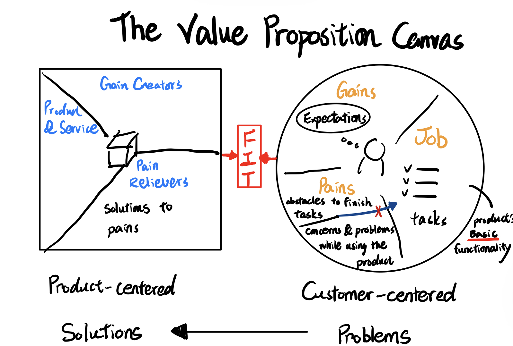

+++
author = "David Chen"
title = "Understanding The Value Proposition Canvas"
date = "2022-02-09"
description = "The Value Proposition Canvas in Plain English"
image = "value-proposition-canvas.jpeg"
slug = "what-is-the-value-proposition-canvas"
categories = [
    "notes"
]

tags = [
    "business-foundations",
]
    
+++

The Value Proposition Canvas helps businesses clarify the value of their products or services they provide to the customer. It is divided into 2 parts: customer and product profiles. The analysis can normally have 3 main layers: practical, emotional, and social.

## Customer Profile

The customer profile is customer centric. It discusses the product from 3 angles - job, pains, and gains.

### Job - **tasks that the product / service can help complete**

Practicality is the product's function or performance (a car taking you from A to B). Socially, customers might buy the product to tell other people about themselves (a handbag form a luxury brand). Emotionally, customers buys products that make them feel motivated or energetic (energy drinks).

### Pains - **obstacles that avoid customers to complete tasks**

Pains are all the problems, hassles, and pains customers face when they want to complete tasks. It is worth noting that it is common for customers to have new concerns and worries **because of the product** (buying a Tesla gives us concerns of running out of batteries).

### Gains - **the benefit customers get, or those features that are beyond their expectation**

Gains are what the customers expect from this products other than the basic functionality. And what are some things the company provides that exceed their expectations. Gains are **NOT** the exact opposite of pains. They're sometimes the hidden ambitions people have. A cheaper or higher price, brand recognition, design, great customer service can all be gains.

## Product Profile

Product profile is business-centered. It shows how company's products / services respond to the customer profiles on 3 angles, which should correspond to customer's job, pains, and gains.

### Product & Service

**Basic** services and functions the company provides. This should help the customers complete their "*jobs*".

### Pain Relievers

These are the features of services and functions that help solve customers' pains.

### Gain Creators

Additional services and products of the company that satisfy or even surprise customers.

## Market-fit

When the two profiles match, that means the product finds a market fit, which is the most ideal scenario.